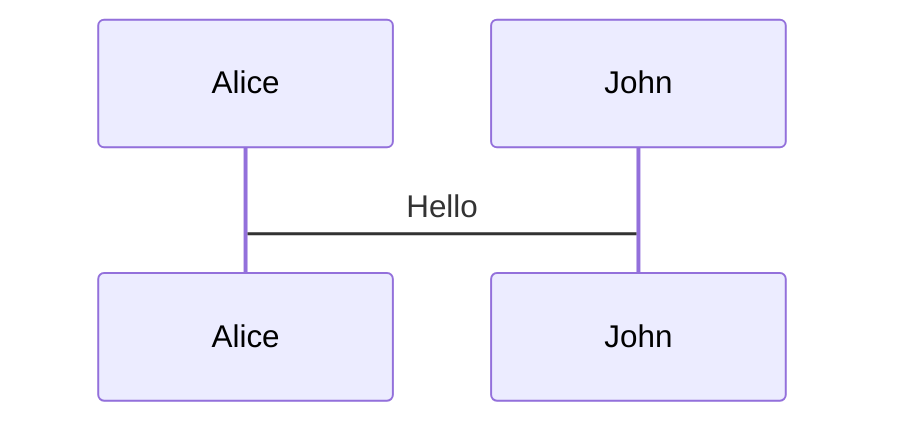
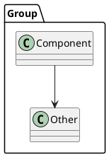

# Slidev Presentation — Agent Reference

> Cognitive Complexity & `complexipy` — Python Cali Meetup
>
> **Language:** All slide content is written in **Spanish**.

## Project Context

This is a **Slidev** presentation for a talk about cognitive complexity and the `complexipy` Python library. The key presentation goal is demonstrating **code refactoring transitions** — showing high-complexity code morphing into clean, low-complexity code using Slidev's animation features.

**Package manager:** Bun (`bun.lock` present)  
**Slidev version:** `@slidev/cli ^52.16.0`  
**Theme:** `apple-basic`  
**Main file:** `slides.md` (all slides live here or in imported sub-files)
**Design guide:** `DESIGN.md` — color palette, card styling, typography, animation rules (MUST read before creating/editing slides)
**Dev command:** `bun run dev`
**Build command:** `bun run build`  
**Export command:** `bun run export` (PDF/PNG/PPTX)

## External Source Dependencies

### complexipy Library

- **Source root:** `/Users/rhafid/opensource-projects/complexipy`
- **Cognitive Complexity algorithm:** `/Users/rhafid/opensource-projects/complexipy/src/cognitive_complexity.rs`

> **IMPORTANT:** Whenever writing about `complexipy` or the cognitive complexity algorithm, you MUST first read and validate the actual source code to ensure correctness. Do not rely on assumptions or general knowledge — verify the implementation details by inspecting the Rust source file at the path above. This applies to:
> - How `complexipy` computes cognitive complexity scores
> - The algorithm's rules (nesting increments, structural penalties, etc.)
> - How the library exposes its API and integrates with Python
> - Any claims about specific code examples and their resulting complexity values

## Design Rules

> These rules are MANDATORY for every slide. Violations make the presentation look AI-generated and inconsistent.
> Before creating or editing ANY slide, also read `DESIGN.md` (complete style guide).

### Color System: 1 Token = 1 Purpose

Never use a color token for multiple semantic meanings. This is the #1 cause of "AI template" feel.

| Token | ONLY for | NEVER for |
|-------|----------|-----------|
| `--accent-blue` | Inline code references (`<code style="color: var(--accent-blue);">if</code>`) | Card headings, callout text, conclusions, titles |
| `--text-primary` | Body text, **all card headings** (white, `font-weight: 700`) | Code references |
| `--accent-yellow` | **Formula expressions only** (`B = 1 + transiciones`) | Slide takeaways, code, card headings, body text |
| `--accent-teal` | Signature/brand: cover mark, `title-tick`, the `<CogCVersus>` device chrome, insight pull-quotes and transition callouts | Code, body paragraphs, card backgrounds |
| `--accent-green` | Exception/positive markers (green headings, green borders) + low-complexity hero numbers | Regular content, penalties |
| `--accent-red` | Penalty/cost markers (warning borders) + high-complexity hero numbers | Informational content, exceptions |
| `--accent-keyword` | Syntax highlighting inside code blocks ONLY | Card headings, UI elements, text outside `<pre>`/code |

**Slide endings must vary** (the #1 AI-template tell): rotate the `<CogCVersus>` device, a white typographic line, a teal pull-quote, a teal inline line, or no closer. Never end every slide with the same centered amber takeaway. See `DESIGN.md`.

### Layout Rules

**Card headings:** Always `color: var(--text-primary); font-weight: 700`. Never colored. This matches the rule cards on slide "Las 3 reglas".

**Card grid trap:** Never use a 2×2 colored grid (4 cards, 4 different accent colors). This is the #1 AI-template giveaway. Use a vertical list with letter/number badges instead.

**Quote variety:** Campbell quotes must vary visually — never repeat the same blockquote card style:
- 1st appearance: Full card blockquote (intro)
- 2nd appearance: Left-border pull-quote (no card background, just `border-left: 3px solid var(--accent-blue)`)
- 3rd appearance: Inline italic text, no container

**Breathing slides:** After every 3-4 content-heavy slides, insert a statement slide:
```markdown
---
layout: statement
---

# Key takeaway here.
```
No cards, no code, no grids. Let the audience absorb.

**Slide density:** A slide should have at most 3 visual elements (cards, code blocks, callouts). If a slide has 4+ layers, split it.

**After/before code:** Side-by-side two-column layout (`display: flex; gap: 16px`). Never vertical stacked before/after with v-click.

### Content Rules

- **Spanish:** No em dashes (`—`), no double hyphens (`--`). Use commas (`,`) for all separators in prose.
- **No emojis** in slides. Use GIFs for visual elements. **Exception:** faithful recreations of `complexipy` CLI output keep the tool's real emoji (`🐙` banner, `✅`/`❌` row markers, `🎉` footer) so the slide matches exactly what attendees see when they run it. Do not strip these.
- **Author attribution:** G. Ann Campbell, SonarSource (2017). Must be credited on the cognitive complexity definition slide.
- **Cognitive complexity scores:** ALWAYS validate against the actual `complexipy` Rust source before claiming any score. Run `uv run complexipy` on the example code and confirm the output.

## Directory Structure

```
.
├── slides.md              # Main presentation (edit this)
├── slidev-magic-move-guide.md  # Reference guide (can be deleted — slides.md is source of truth)
├── package.json           # Dependencies & scripts
├── bun.lock               # Bun lockfile
├── pnpm-workspace.yaml    # pnpm workspace config (for playwright-chromium)
├── netlify.toml           # Netlify deploy config
├── vercel.json            # Vercel deploy config
├── components/
│   └── Counter.vue        # Custom Vue component (auto-registered)
├── pages/
│   └── imported-slides.md # Sub-slides (demonstrates `src:` import)
├── snippets/
│   └── external.ts        # External code snippet (demonstrates `<<<` import)
└── public/                # Static assets (images, etc.) — create as needed
```

## Key Architecture Notes

- `slides.md` is the **single source of truth** — all slides are separated by `---`
- Each slide can have its own **frontmatter** between `---` delimiters
- Components in `components/` are **auto-registered** — use them directly in slides
- Files in `snippets/` can be **imported** into code blocks with `<<< @/snippets/file.ts`
- Sub-slides in `pages/` can be **imported** with `src:` frontmatter
- Slide-scoped `<style>` blocks affect **only the current slide**
- `<script setup>` blocks are **scoped to the current slide** (Vue 3 composition API)
- UnoCSS utilities are available everywhere (Tailwind-compatible)

---

## Slidev Feature Reference

### 1. Frontmatter Configuration

**Global (top of slides.md):**
```yaml
---
theme: apple-basic
title: Cognitive Complexity en Python
titleTemplate: '%s - Python Cali'
author: Robin Hafid Quintero Lopez
transition: slide-left
layout: intro
drawings:
  persist: false
comark: true
duration: 35min
magicMoveDuration: 800    # ms, default 800
magicMoveCopy: 'final'    # true | false | 'always' | 'final'
highlighter: shiki
mdc: true
---
```

**Per-slide (between slide separators):**
```yaml
---
transition: fade-out        # override global transition
layout: two-cols            # use a layout
layoutClass: gap-16         # CSS class on layout wrapper
class: px-20                # CSS class on slide
level: 2                    # heading level for <Toc>
foo: bar                    # custom data (accessible in slide)
---
```

### 2. Slide Transitions

Set globally in headmatter or per-slide in frontmatter.

| Transition | Effect |
|---|---|
| `slide-left` | Slide from right to left |
| `slide-right` | Slide from left to right |
| `slide-up` | Slide from bottom to top |
| `slide-down` | Slide from top to bottom |
| `fade` | Cross-fade |
| `fade-out` | Fade out then fade in |
| `none` | No transition |
| `view-transition` | View Transition API (advanced) |

```yaml
transition: fade-out   # per-slide override
```

### 3. Layouts

Available layouts from `@slidev/theme-default` (21 total):

| Layout | Purpose |
|---|---|
| `default` | Standard layout |
| `center` | Centered content |
| `cover` | Title/cover slide |
| `two-cols` | Side-by-side columns (use `::right::` for right column) |
| `two-cols-header` | Two columns with shared header |
| `image-left` | Image on left, text on right |
| `image-right` | Image on right, text on left |
| `image` | Full-slide image |
| `iframe` | Embed iframe |
| `iframe-left` / `iframe-right` | Iframe with text |
| `section` | Section divider |
| `fact` | Fact/statistic highlight |
| `quote` | Blockquote layout |
| `statement` | Single statement |
| `intro` | Introduction |
| `end` | End slide |
| `full` | Full bleed |
| `none` | No layout |

**Two-column layout example:**
```markdown
---
layout: two-cols
layoutClass: gap-16
---

# Left Column Content

Some text here.

::right::

# Right Column Content

More text here.
```

**Image layout example:**
```markdown
---
layout: image-right
image: https://example.com/image.png
---

# Content on the left

The image appears on the right.
```

### 4. Click Animations (v-click)

Reveal elements one by one on click/arrow key.

**Directive form:**
```html
<div v-click>This appears on click.</div>
```

**Component form:**
```html
<v-click>

This appears on click.

</v-click>
```

**Click range (show/hide at specific clicks):**
```html
<v-click at="[2, 5]">
  Appears at click 2, disappears at click 5.
</v-click>
```

**Batch list animation:**
```html
<v-clicks>

- Item 1 (appears on click 1)
- Item 2 (appears on click 2)
- Item 3 (appears on click 3)

</v-clicks>
```

**Show on same click as previous element:**
```html
<div v-click>First element</div>
<div v-after>Appears at the same time as above</div>
```

**v-click modifiers:**

| Modifier | Effect |
|---|---|
| `v-click` | Default fade animation |
| `v-click.up` | Slide from bottom |
| `v-click.fade-in` | Fade in |
| `v-click.fade` | Dim (0.5 opacity) — used to de-emphasize previous content |
| `v-click.fade.right.scale` | Composed: fade + move right + scale |
| `v-click.none` | No transition (instant appear) |

**Example with multiple modifiers:**
```html
<div v-click>This is normal</div>
<div v-click.fade>This gets dimmed on next click</div>
<div v-click.up>This slides up on next click</div>
```

### 5. Motion Animations (v-motion)

Powered by `@vueuse/motion`. Animate position, scale, rotation, opacity, color.

**Basic usage:**
```html
<div v-motion
  :initial="{ x: -80, opacity: 0 }"
  :enter="{ x: 0, opacity: 1 }"
  :leave="{ x: 80, opacity: 0 }">
  Animated content
</div>
```

**Click-triggered motion (key for complexity score animations):**
```html
<div v-motion
  :initial="{ scale: 2, color: 'red' }"
  :enter="{ scale: 1, color: 'green' }"
  :click-1="{ scale: 1.5, color: 'orange' }"
  :click-2="{ scale: 1, color: 'green' }">
  CC: 24 → 3
</div>
```

**Motion variant reference:**

| Variant | When it activates |
|---|---|
| `:initial` | Before slide or hidden by v-click |
| `:enter` | When slide is visible (lowest priority) |
| `:click-N` | When `$clicks >= N` (priority: N) |
| `:click-N-M` | When `N <= $clicks < M` (priority: N) |
| `:leave` | When moving past slide |

**Spring physics animation:**
```html


<script setup lang="ts">
const final = {
  x: 0, y: 0, rotate: 0, scale: 1,
  transition: {
    type: 'spring',
    damping: 10,
    stiffness: 20,
    mass: 2
  }
}
</script>
```

**Delayed animation:**
```html
<div v-motion
  :initial="{ x: -80, opacity: 0 }"
  :enter="{ x: 0, opacity: 1, transition: { delay: 2000, duration: 1000 } }">
  Delayed entrance
</div>
```

### 6. Shiki Magic Move (KEY FEATURE)

Code block morphing transitions — the core animation for showing refactoring progress.

**Syntax: use 4 backticks to open, nest code blocks inside:**

````md
````md magic-move
```python
# Step 1: High complexity code
def process(data):
    result = []
    for item in data:
        if item.valid:
            result.append(item.transform())
    return result
```

```python
# Step 2: Refactored — low complexity
def process(data: list[Item]) -> list[Transformed]:
    return [item.transform() for item in data if item.valid]
```
````

**With line highlighting (progressive focus):**
````md
````md magic-move {lines: true}
```python {*|1-3|5-8}
def process(data):
    result = []
    for item in data:
        if item.valid:
            result.append(item.transform())
    return result
```

```python {1-2}
def process(data: list[Item]) -> list[Transformed]:
    return [item.transform() for item in data if item.valid]
```
````

- `{lines: true}` — show line numbers on all steps
- `{*|1-3|5-8}` — step through: all → highlight 1-3 → highlight 5-8
- `{1-2}` — highlight lines 1-2 on this step

**With filename title bar:**
````md
````md magic-move [process.py]
```python
# code here
```
````

**With custom duration:**
````md
````md magic-move {duration:500}
```python
# step 1
```

```python
# step 2
```
````

**Global config (headmatter):**
```yaml
magicMoveDuration: 800   # ms
magicMoveCopy: 'final'   # copy button only on last step
```

**Line highlighting syntax within code blocks:**

| Syntax | Meaning |
|---|---|
| `{all}` or `{*}` | Highlight all lines |
| `{4}` | Highlight line 4 |
| `{6-7}` | Highlight lines 6-7 |
| `{all\|4\|6-7\|9\|all}` | Step through: all → 4 → 6-7 → 9 → all |
| `{*\|2\|*}` | Step through: all → 2 → all |
| `{*\|1-2\|3-4\|3-4,8}` | Step through: all → 1-2 → 3-4 → 3-4,8 |

### 7. Inline Marks (v-mark)

Powered by Rough Notation — highlight/annotate text inline.

```html
<span v-mark.red>highlighted in red</span>
<span v-mark.circle.orange>circled in orange</span>
<span v-mark.underline.orange>underlined in orange</span>
```

**Click-triggered marks:**
```html
<span v-mark.red="7">Highlighted at click 7</span>
<span v-mark.circle.orange="8">Circled at click 8</span>
```

### 8. Code Blocks

**Basic with line highlighting:**
````md
```ts {all|4|6|6-7|9|all}
import { computed, ref } from 'vue'

const count = ref(0)
const doubled = computed(() => count.value * 2)

doubled.value = 2
```
````

**With filename and twoslash (TypeScript hover info):**
````md
```ts [filename.ts] {all|4} twoslash
import { ref } from 'vue'
const count = ref(0)
```
````

**External code import:**
````md
<<< @/snippets/external.ts#snippet
````

The source file must use `#region snippet` / `#endregion snippet` markers:
```ts
// #region snippet
export function emptyArray<T>(length: number) {
  return Array.from<T>({ length })
}
// #endregion snippet
```

**Import with line range:**
````md
<<< @/snippets/external.ts{1,3-5}
````

**Import with highlighting:**
````md
<<< @/snippets/external.ts#snippet{2}
````

**Diff code blocks:**
````md
```diff
- old code
+ new code
```
````

**Monaco Editor (live editable code):**
````md
```ts {monaco}
import { ref } from 'vue'
const count = ref(0)
```
````

**Monaco with execution:**
````md
```ts {monaco-run}
console.log('Hello from Monaco!')
```
````

### 9. Diagrams

**Mermaid:**
````md

````

Mermaid types: `sequenceDiagram`, `graph TD`/`graph LR`, `mindmap`, `classDiagram`, `stateDiagram`, `pie`, `gantt`, etc.

**PlantUML:**
````md

````

### 10. LaTeX / Math

**Inline:** `$\sqrt{3x-1}+(1+x)^2$`

**Block with line highlighting:**
```md
$$ {1|3|all}
\begin{aligned}
\nabla \cdot \vec{E} &= \frac{\rho}{\varepsilon_0} \\
\nabla \cdot \vec{B} &= 0
\end{aligned}
$$
```

Powered by KaTeX.

### 11. Draggable Elements

**Directive form:**
```html

```

**Component form:**
```html
<v-drag text-3xl>
  <div>Draggable content</div>
</v-drag>
```

**With initial position (frontmatter):**
```yaml
dragPos:
  myElement: 691,32,167,_,-16   # x,y,width,_,rotation
```

**Draggable arrows:**
```html
<v-drag-arrow two-way />
```

Double-click draggable elements in presenter mode to reposition them.

### 12. Components

**Built-in components:**
- `<Toc minDepth="1" maxDepth="2" />` — Table of contents
- `<PoweredBySlidev />` — Branding footer
- `<Tweet id="..." />` — Twitter embed
- `<BlueSky src="..." />` — Bluesky embed
- `<Youtube id="..." />` — YouTube embed
- `<SlideCurrentNo />` — Current slide number
- `<SlidesTotal />` — Total slides count
- `<LightOrDark>` — Conditional rendering for dark/light mode
- `<Arrow>` — Animated SVG arrow
- `<Mermaid>` — Inline Mermaid component
- `<Monaco>` — Inline Monaco editor

**Custom components:** Place `.vue` files in `components/` — they're auto-registered:
```vue
<script setup lang="ts">
import { ref } from 'vue'
const props = defineProps({ count: { default: 0 } })
const counter = ref(props.count)
</script>
<template>
  <button @click="counter -= 1">-</button>
  <span>{{ counter }}</span>
  <button @click="counter += 1">+</button>
</template>
```

Use in slides: `<Counter :count="10" />`

### 13. Slide Importing

Split presentations across multiple files:

```yaml
---
src: ./pages/imported-slides.md
hide: false
---
```

### 14. Presenter Notes

HTML comments at the end of a slide become presenter notes:

```markdown
---

# Slide Title

Content here.

<!--
These are presenter notes.
They appear in Presenter Mode.

[click] This syncs with click 1
[click] This syncs with click 2
[click:3] This syncs with click 3 (skip 2 clicks)
-->
```

### 15. Slide-Scoped Styling

```html
<style>
h1 {
  background: linear-gradient(45deg, #4EC5D4 10%, #146b8c 20%);
  -webkit-background-clip: text;
  -webkit-text-fill-color: transparent;
}
</style>
```

Scoped `<style>` blocks affect **only the current slide**.

### 16. UnoCSS Utilities

Slidev uses UnoCSS (Tailwind-compatible). Available everywhere:

```html
<div class="text-center">Centered text</div>
<div class="grid grid-cols-4 gap-5">Grid layout</div>
<div class="font-mono text-xs opacity-60">Typography</div>
<div flex="~" border="~ main rounded-md" p="2">Shorthand attributes</div>
<div m="t-4">Margin top</div>
<div hover:bg="white op-10">Hover state</div>
```

### 17. Arrow Component

```html
<arrow v-click="[4, 5]" x1="350" y1="310" x2="195" y2="342" color="#953" width="2" arrowSize="1" />
```

Draws an animated SVG arrow overlay. Use `v-click` to control when it appears.

### 18. Keyboard Shortcuts (Presenter Mode)

| Key | Action |
|---|---|
| `→` / `Space` | Next animation or slide |
| `←` / `Shift+Space` | Previous animation or slide |
| `↑` | Previous slide |
| `↓` | Next slide |
| `o` | Open slide overview |
| `d` | Toggle dark mode |
| `g` | Go to slide number |
| `f` | Fullscreen |

---

## Presentation-Specific Patterns

### Before/After Refactoring (Two-Column)

```markdown
---
layout: two-cols
---

# Before (CC: 12)

```python
def process(data):
    result = []
    for item in data:
        if item.active:
            if item.age > 18:
                result.append(item)
    return result
```

::right::

# After (CC: 2)

```python
def process(data: list[User]) -> list[User]:
    return [u for u in data if u.active and u.age > 18]
```
```

### Progressive Refactoring (Magic Move)

Show multiple refactoring steps in one animated block:

````md
````md magic-move [module.py]
```python
# Step 1: Original high-complexity code
def process(data):
    result = []
    for item in data:
        if item.valid:
            if item.active:
                result.append(item.transform())
    return result
```

```python
# Step 2: Extract condition
def is_valid_active(item):
    return item.valid and item.active

def process(data):
    result = []
    for item in data:
        if is_valid_active(item):
            result.append(item.transform())
    return result
```

```python
# Step 3: List comprehension
def process(data: list[Item]) -> list[Transformed]:
    return [item.transform() for item in data if item.valid and item.active]
```
````

### Complexity Score Animation

Animate the complexity score changing with v-motion:

```html
<div v-motion
  :initial="{ scale: 2, color: '#ef4444' }"
  :enter="{ scale: 1, color: '#22c55e', transition: { duration: 1000 } }">
  CC: 24 → 3
</div>
```

### Combining Magic Move + v-click + v-mark

For maximum impact — morph the code, then highlight key changes:

````md
````md magic-move
```python
def process(data):
    result = []
    for item in data:
        if item.valid:
            result.append(item.transform())
    return result
```

```python
def process(data: list[Item]) -> list[Transformed]:
    return [item.transform() for item in data if item.valid]
```
````

<v-click>

<span v-mark.underline.green>6 lines → 2 lines. Complexity reduced.</span>

</v-click>
```

---

## Deployment

**Netlify** — `netlify.toml` configured, build: `npm run build`, publish: `dist`  
**Vercel** — `vercel.json` configured, build: `npm run build`, output: `dist`

**Export PDF:**
```bash
bun run export
# or: npx slidev export
```

**Export static HTML:**
```bash
bun run build
# or: npx slidev build
```

---

## Useful Links

- Slidev docs: https://sli.dev
- Magic Move: https://sli.dev/features/shiki-magic-move
- Animations: https://sli.dev/guide/animations
- Themes: https://sli.dev/resources/theme-gallery
- Components: https://sli.dev/builtin/components
- Layouts: https://sli.dev/builtin/layouts
